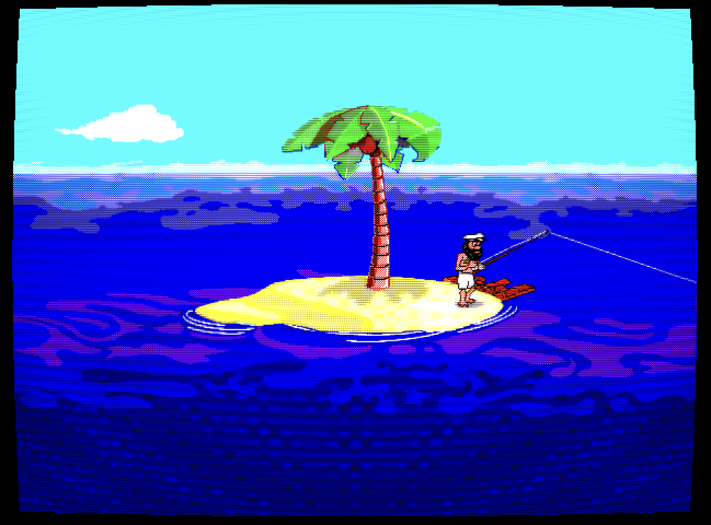
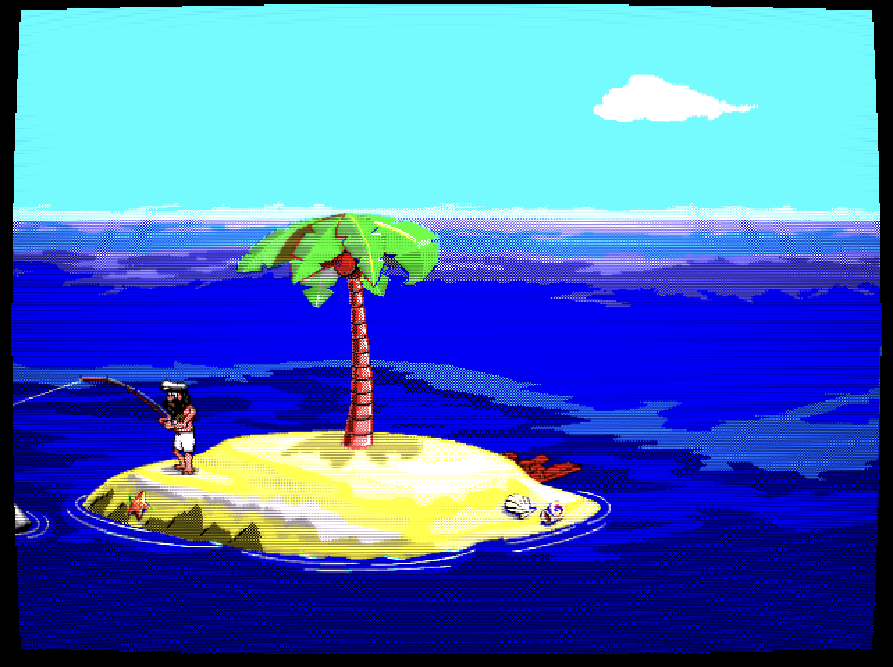

# Johnny Castaway - Reborn (Web)

| Screenshot                           | Screenshot with shader                                  |
| ------------------------------------ | ------------------------------------------------------- |
|  |  |

This is an AI-assisted browser port of [Johnny Reborn](https://github.com/jno6809/jc_reborn), an open source engine for the classic [Johnny Castaway](https://en.wikipedia.org/wiki/Johnny_Castaway) screen saver — developed by Dynamix for Windows 3.x and published by Sierra On-Line in 1992, marketed under the **Screen Antics** brand.

Written in TypeScript, runs entirely in the browser with no server-side logic. Uses the original game data files, which are not included.

I've also added some small fixes and features, such as debug screen top preview all the assets and integration with the great [webgl-crt-shader](https://github.com/gingerbeardman/webgl-crt-shader) by [gingerbeardman](https://github.com/gingerbeardman).

## Setup

### Data files

You need the two original data files placed in `public/data/`:

| File           | Size (bytes) | MD5                                |
| -------------- | ------------ | ---------------------------------- |
| `RESOURCE.MAP` | 1461         | `8bb6c99e9129806b5089a39d24228a36` |
| `RESOURCE.001` | 1175645      | `374e6d05c5e0acd88fb5af748948c899` |

### Sound files (optional)

Place WAV files in `public/data/`. They can be obtained from the [JCOS project repository](https://github.com/nivs1978/Johnny-Castaway-Open-Source/tree/master/JCOS/Resources).

| File        | MD5                                |
| ----------- | ---------------------------------- |
| sound0.wav  | `53695b0df262c2a8772f69b95fd89463` |
| sound1.wav  | `35d08fdf2b29fc784cbec78b1fe9a7f2` |
| sound2.wav  | `f93710cc6f70633393423a8a152a2c85` |
| sound3.wav  | `05a08cd60579e3ebcf26d650a185df25` |
| sound4.wav  | `be4dff1a2a8e0fc612993280df721e0d` |
| sound5.wav  | `24deaef44c8b5bb84678978564818103` |
| sound6.wav  | `eb1055b6cf3d6d7361e9a00e8b088036` |
| sound7.wav  | `cab94bace3ef401238daded2e2acec34` |
| sound8.wav  | `39515446ceb703084d446bd3c64bfbb0` |
| sound9.wav  | `f86d5ce3a43cbe56a8af996427d5c173` |
| sound10.wav | `5b8535f625094aa491bf8e6246342c77` |
| sound12.wav | `8c173a95da644082e573a0a67ee6d6a3` |
| sound14.wav | `e064634cfb9125889ce06314ca01a1ea` |
| sound15.wav | `b3db873332dda51e925533c009352c90` |
| sound16.wav | `2eabfe83958db0cad77a3a9492d65fe7` |
| sound17.wav | `2497d51f0e1da6b000dae82090531008` |
| sound18.wav | `994a5d06f9ff416215f1874bc330e769` |
| sound19.wav | `5e9cb5a08f39cf555c9662d921a0fed7` |
| sound20.wav | `80e7eb0e0c384a51e642e982446fcf1d` |
| sound21.wav | `1a3ab0c7cec89d7d1cd620abdd161d91` |
| sound22.wav | `a0f4179f4877cf49122cd87ac7908a1e` |
| sound23.wav | `52fc04e523af3b28c4c6758cdbcafb84` |
| sound24.wav | `5a6696cda2a07969522ac62db3e66757` |

## Running

```sh
pnpm install
pnpm dev
```

Open `http://localhost:5173`.

To debug assets, open `http://localhost:5173/debug.html`

## Controls

Hover over the canvas to reveal the control bar (top-right corner):

| Control             | Action                                           |
| ------------------- | ------------------------------------------------ |
| 🔇 / 🔊             | Toggle sound (first click activates audio)       |
| ⛶                   | Toggle fullscreen                                |
| 📺                  | Toggle CRT scanline effect                       |
| Double-click canvas | Toggle fullscreen                                |
| `H`                 | Toggle debug HUD (FPS, thread count, scene name) |

## Building

```sh
pnpm build
```

Output goes to `dist/`. Serve as a static site.

## Thanks

Since this project is almost 100% ported from [Johnny Reborn](https://github.com/jno6809/jc_reborn) code, all credits for the hard work should go to [Jérémie GUILLAUME (jno6809)](https://github.com/jno6809) and the following people that assisted they on this journey:

- Hans Milling aka nivs1978, author of the JCOS project - main source of info for my first lines of the Johnny Reborn code
  - https://github.com/nivs1978/Johnny-Castaway-Open-Source
  - http://nivs.dk/jc/
- Alexandre Fontoura aka xesf, author of castaway project - similar to Johnny Reborn, but in Javascript
  - https://github.com/xesf/castaway
  - https://castaway.xesf.net/viewer/
- The Sierra Chest website, which has a nice section about Johnny Castaway, with many screenshots and video captures. Those turned out to be quite helpful:
  - http://sierrachest.com/index.php?a=games&id=255&title=johnny-castaway

Hans Milling thanks a number of people for giving him (or helping him find) some info about the original engine. They should not be forgotten, and I thank them - indirectly - as well:

- Jeff Tunnel - For helping getting in contact with some of the original developers
- Kevin and Liam Ryan - Assisting with information about the resource files
- Jaap - Helping in finding the format of the resource files
- Gregori - Assisting with the Lempel-Ziv decompression
- Guido - The author of the xBaK project that led to understanding the TTM and ADS commands.

Thanks to [Matt Sephton (gingerbeardman)](https://github.com/gingerbeardman) as well, for the [webgl-crt-shader](https://github.com/gingerbeardman/webgl-crt-shader).
